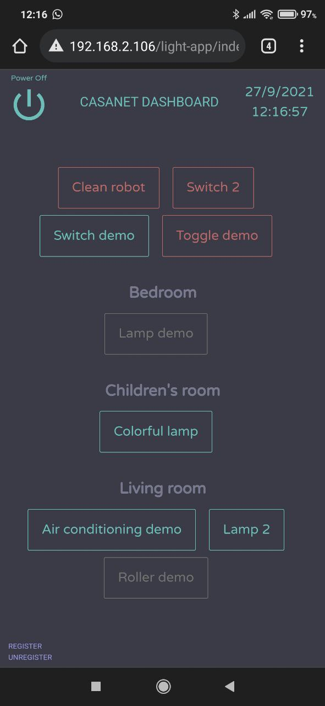

# The Casanet Lightweight Dashboard

The very minimal Casanet UI based vanilla HTML + CSS + JS without *any* other library/framework, wight in total below ~20KB!!!

Used for very slow networks and devices.

The lightweight dashboard served URL is `[CDN / local address]/light-app/index.html`.

The source code is ready to use (no need any build process), to set custom API_URL, run `node scripts/set-environment.js` with `API_URL`  env var.
